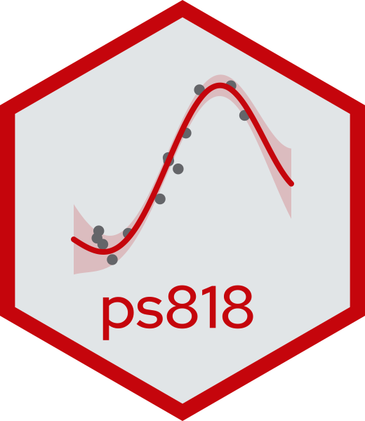

::: {.grid}

::: {.g-col-12 .g-col-sm-8 .order-2 .order-sm-1}

[Data Analysis with Statistical Models]{style="font-size: 4em; font-weight: bold;"}

[Likelihood, Bayesian and Machine Learning methods for description and prediction]{style="font-size: 2em;"}

[PoliSci 818 • Fall 2026 University of Wisconsin-Madison]{style="color: grey;"}

:::

::: {.g-col-12 .g-col-sm-4 .order-1 .order-sm-2}

{.img-fluid style="max-width: 300px;"}

:::

:::

::: {.grid .course-details}

::: {.g-col-12 .g-col-sm-6 .g-col-md-4}

### Instructor

-  &nbsp; [Anton Strezhnev](https://www.antonstrezhnev.com)
-  &nbsp; North Hall 322D
-  &nbsp; [strezhnev@wisc.edu](mailto:strezhnev@wisc.edu)

:::

::: {.g-col-12 .g-col-sm-6 .g-col-md-4}

### Course details

-  &nbsp; Mondays & Wednesdays
-  &nbsp; 9/9/2026 - 12/9/2026
-  &nbsp; 9:30am - 10:45am
-  &nbsp; Sterling Hall 1339

:::

::: {.g-col-12 .g-col-md-4 .contact-policy}

### Contacting me

Slack is the best way to get in touch with me. My dedicated office hours are **9AM-11AM on Tuesdays** if you want to meet in-person. I am also generally in my office on weekdays during normal hours and my door is open, so you are welcome to drop in. You can also feel free to contact me to confirm availability or to schedule a virtual meeting via Zoom.

:::

:::
