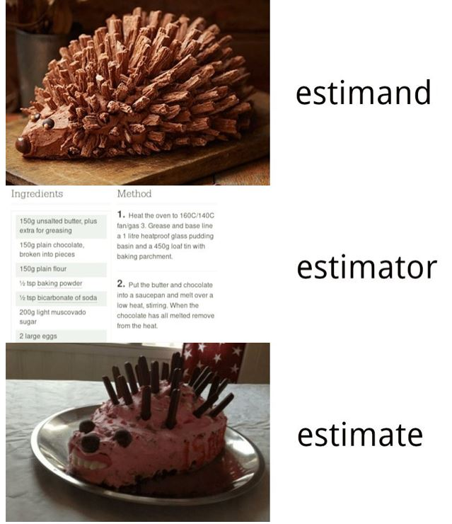

## Welcome! {.title-slide}

$$
  \require{cancel}
  \DeclareMathOperator*{\argmin}{arg\,min}
$$

$$
 \DeclareMathOperator*{\argmax}{arg\,max}
$$

```{r, echo = F, message=F, warnings=F}
library(tidyverse)
library(knitr)
options(digits=3)
```

## Week overview

::: {.incremental}

- This week
  - **Introductions** + course logistics
  - What is a statistical model and what is it good for?
  - Review: estimands, estimators, and linear regression
- Next week
  - Parametric models and the **likelihood function**
  - Maximum likelihood estimation
- Long-run
  - **likelihood** $\to$ **Bayes** $\to$ **flexible regression**

:::

## Course Overview

::: {.incremental}

- Instructor: **Anton Strezhnev**
- **Logistics**:
  - **Lectures** Mon/Wed - 9:30am-10:45am, Sterling Hall 1339
  - *4* Problem Sets (~ 2 weeks each)
  - *2* in-class midterms (October 7, November 4)
  - Replication project poster (December 4th)
  - **No final exam** during the university exam period

:::

## Course Overview

::: {.incremental}

- **My office hours:** Tuesdays 9am-11am (North Hall 322D)
  - Or just drop in -- I'm usually around and my door is open.
- **Course Website**: [https://www.antonstrezhnev.com/ps818](https://www.antonstrezhnev.com/ps818)
- Announcements and discussion happen on **Slack** - you should have received an invite.
- Problem sets are submitted on **Gradescope**; solutions get posted to **Canvas**.

:::

## Course objectives

::: {.incremental}

- What is this course about?
  - *Defining* statistical models via their data-generating process
  - *Estimating* model parameters and conducting *inference*
  - *Interpreting* model output and *evaluating* model quality
- Goals for the course
  - Give you the tools to understand descriptive and predictive inference via statistical models -- and to comment on other researchers' work.
  - Equip you with the fundamentals of **likelihood** and **Bayesian** inference so that you can learn new models that build on these principles.
  - Connect these principles to the particular research questions *you* want to answer.
  - Teach you how to program and implement estimators by yourself!

:::

## Course workflow 

::: {.incremental}

- **Lectures** (Mondays/Wednesdays)
  - Topics organized by week: Monday introduces the core theory, Wednesday goes deeper and works through applications.
  - Lectures are the "course notes" -- readings are the reference manuals.
  - I want lectures to be **interactive** - you should ask questions and interrupt!
- **Readings**
  - Mix of textbooks and papers -- see the [Schedule](https://www.antonstrezhnev.com/ps818/schedule.html) page.
  - Main texts: *Regression and Other Stories* [@gelman2020ros], *Bayesian Data Analysis* [@gelman2013bda], *Statistical Rethinking* [@mcelreath2020rethinking], and *An Introduction to Statistical Learning* [@james2013isl]
  - Everything is available digitally, either free online or through the UW-Madison library.
  - Do the readings before that week's lectures -- definitely before the Wednesday.
  
:::

## Course workflow

::: {.incremental}

- **Problem sets** (20% of your grade)
  - *Four* problem sets, each covering roughly a two-week block of material.
  - Meant as a check on your understanding of the material and a way of communicating with me about the course.
  - Designed to be challenging -- I *expect* you to find some questions hard.
  - Collaboration is **strongly encouraged** -- ask and answer questions on **Slack**.
    - But write up your own answers and your own code.
  - Distributed as `.qmd` + rendered `.html`; submit both on **Gradescope**.
  - Graded holistically on a plus/check/minus system.
  
:::

## Course workflow

::: {.incremental}

- **Two in-class midterms** (20% of your grade each)
  - **October 7** -- material through Week 4 (likelihood inference and GLMs)
  - **November 4** -- material from Weeks 5-8 (Bayesian inference, multilevel models, mixtures)
  - Closed-book, pen-and-paper, in class. Both theory and interpretation of sample code/output.
  - This is a change from previous years -- no more take-home exams.

:::

## Course workflow

::: {.incremental}

- **Replication project** (30% of your grade)
  - Work in **pairs** to replicate and extend a published paper.
  - Start by reading @king1995replication on *why* we do this.
  - Steps: find a paper $\to$ obtain the data $\to$ reproduce the result $\to$ **extend** it $\to$ write it up.
    - The extension is where this course comes in: flexible regression adjustment, a better-specified likelihood, a multilevel model, additional confounders...
  - Ungraded check-in **memo** due **October 21** -- shows me you've replicated something and have a plan.
  - Presented as a **poster** at the MEAD graduate poster session, **December 4th**.

:::

## Course workflow

::: {.incremental}

- **Participation** (10% of your grade)
  - It is important that you actively engage with lecture -- ask and answer questions.
  - Do the reading!
  - Participating on Slack counts towards this as well, as does attending MEAD talks.
- **Models, Experiments and Data (MEAD) workshop**
  - Check out the Fall 2026 schedule: [https://sites.google.com/view/meadwisc/home](https://sites.google.com/view/meadwisc/home)

:::

## Assignment timeline

::: {.incremental}

- **Problem Set 1:** Assigned September 9, due September 23
- **Problem Set 2:** Assigned September 23, due October 7
- **Midterm 1:** In class, Wednesday, October 7
- **Problem Set 3:** Assigned October 7, due October 21
- **Replication memo:** Due October 21
- **Problem Set 4:** Assigned October 21, due November 4
- **Midterm 2:** In class, Wednesday, November 4
- **Replication poster:** MEAD poster session, Friday, December 4

:::

## Class Requirements

::: {.incremental}

- **Overall**: An interest in learning and willingness to ask questions.
- I assume a background in intro probability and statistics (the 1st year sequence)
  - You should be comfortable thinking about basic estimands/estimators + their properties.
  - You should be able to interpret a confidence interval for (e.g.) a difference-in-means.
- Some prior knowledge of causal inference is helpful but not *critical*
  - We'll be connecting predictive models to causal estimands.
  - Ideally you're familiar with the **potential outcomes** framework.
- You should also be familiar with linear regression
  - $\hat{\beta} = (\mathbf{X}^{\prime}\mathbf{X})^{-1}\mathbf{X}^{\prime}Y$ should be a familiar expression.
  - You should know when it's unbiased for $\mathbb{E}[Y|\mathbf{X}]$, and when it's efficient.
- If you want some review, check out chapters 1-7 of *Regression and Other Stories*

:::

## Statistical computing

::: {.incremental}

- All of the work in this course is done in 
  - We will implement estimators **from scratch** -- optimizers, samplers, EM steps.
  - Packaged implementations are great, but you should know what's inside the box.
- We'll also use [**Stan**](https://mc-stan.org/) for Bayesian models (via `rstan`/`brms`)
  - Stan needs a working C++ toolchain -- get this installed **early**, not the night before Problem Set 3.
- Assignments are written and submitted in **Quarto**
- More broadly, I want you to learn how your **computer** works for research
  - Kieran Healy's [**Modern Plain Text Computing**](https://mptc.io/) [@healy2025mptc] is a great resource.

:::

## LLM Policy

::: {.incremental}

- See the syllabus for the long version.
- In short...
  - You should have LLMs **do** things for you
  - You should not have LLMs **think** for you
  - You should *definitely* not have LLMs **speak** for you
- Formally, you may use LLMs however you like on the problem sets -- any other rule is unenforceable.
  - But the problem sets are how you *learn to code*, and the midterms are the check.
  - Delegating the mechanics means you can't debug, and you can't diagnose errors.
- Empirical research has an ["O-ring" production function](https://paulgp.substack.com/p/ai-and-the-research-o-ring) -- one tiny error breaks everything.
  - And LLM failure modes are *weirder* than human failure modes.
- The replication poster must be **entirely human-authored**.

:::

## Acknowledgements

::: {.incremental}

- This course is an iteration in the broader project of methods education in **political methodology** and is indebted to many of those who have taught versions of this course in the past and at other institutions.
  - Particularly Gov 2001/Gov 2003 at Harvard and Quant III at MIT.
  - Thanks to Matthew Blackwell, Brandon Stewart, Erin Hartman, Molly Roberts, Kosuke Imai, Teppei Yamamoto, Jens Hainmueller, Adam Glynn, Gary King, Justin Grimmer, and In Song Kim, whose lecture notes and syllabi have been immensely valuable.
  - And special thanks to Andrew Heiss for the modern website/Quarto approach to teaching materials.

:::

## A brief overview

::: {.incremental}

- **Weeks 2-4:** Likelihood inference and generalized linear models
  - The likelihood function, MLE and its asymptotic properties
  - Binary outcome models, count models, duration models
  - *First midterm: Wednesday, October 7*
- **Weeks 5-7:** Bayesian inference and multilevel models
  - Posteriors, priors, and the data; posterior means and credible intervals
  - Estimation via MCMC in Stan
  - Multilevel regression and post-stratification (MRP)
- **Week 8:** Mixture models and the EM algorithm
- **Week 9:** Item response theory and ideal point models
  - *Second midterm: Wednesday, November 4*

:::

## A brief overview

::: {.incremental}

- **Week 10:** Regularization and model selection (ridge, LASSO, cross-fitting)
- **Week 11:** Flexible regression -- trees, forests and BART
- **Week 12:** Flexible regression -- kernels and Gaussian processes
- **Week 13:** Causal inference with flexible regression
  - Influence functions and "doubly-robust"/Neyman-orthogonal estimators
  - *MEAD poster session: Friday, December 4*
- **Week 14:** Working with "big" datasets
  - Out-of-memory estimation, stochastic gradient descent, lossless compression

:::

## What is a statistical model? {.title-slide}

## What is a statistical model?

::: {.incremental}

- A **statistical model** is a set of assumptions about the process that generated the data.
  - Formally: a family of probability distributions $\{f(y; \theta) : \theta \in \Theta\}$ indexed by a parameter $\theta$.
  - We assume the observed data are a draw from *one* member of that family, and we want to figure out **which one**.
- Two things a model buys you:
  - **Structure** -- a way to pool information and extrapolate beyond exactly what you observed.
  - **A likelihood** -- an explicit statement of how probable your data are under any candidate $\theta$.
- Two things it costs you:
  - Every assumption is a place where you can be **wrong**.
  - Model-based answers are only as good as the model.

:::

## What is a statistical model?

::: {.incremental}

> All models are wrong, but some are useful.
>
> --- George Box [-@box1976science]

- The relevant question is never "is the model true?" (it isn't)
- It's: **is the model wrong in a way that matters for the question I'm asking?**
  - A misspecified likelihood can still give a consistent estimator of a well-defined estimand.
  - Or it can give you a confidently wrong answer.
- Much of this course is about developing the judgment to tell those two cases apart.

:::

## What is a model good for?

::: {.incremental}

- **Description**: summarize a joint distribution
  - "How does turnout vary with age, once we account for education?"
- **Prediction**: guess $Y$ for a unit where we observe only $X$
  - "What share of this state's voters support the referendum?" (Week 7 -- MRP)
- **Measurement**: recover a latent quantity we never observe directly
  - "How liberal is this Supreme Court justice?" (Week 9 -- ideal points)
- **Causal inference**: a *design* identifies the estimand; a *model* does the adjustment
  - "What would turnout have been under a different policy?" (Week 13)

:::

## Two cultures

::: {.incremental}

- @breiman2001two draws a distinction between two ways of using models:
  - **Data modeling**: assume a stochastic model generated the data; estimate and interpret its parameters.
  - **Algorithmic modeling**: treat the data-generating process as unknown; find a function that predicts well.
- @shmueli2010explain makes a related point: **explaining** and **predicting** are different goals and lead to different modeling choices.
  - The model with the lowest prediction error is often *not* the model with the most interpretable parameters.
- This course walks from one end to the other:
  - Weeks 2-9 are firmly "data modeling" -- we write down a DGP.
  - Weeks 10-12 are "algorithmic" -- we care about fit, not parameters.
  - Week 13 shows how to use the second in service of the first.

:::

## Estimation review {.title-slide}

## Random variables

::: {.incremental}

- Understanding the behavior and properties of **random variables** is at the core of statistical theory.
- (Simply put) a random variable $X$ is a mapping from a **sample space** to the real number line
  - Random variables have a *distribution* (which we may or may not assume we know) defined by the cumulative distribution function (CDF)
  
  $$F(x) = Pr(X \le x)$$
  
:::

## Random variables

::: {.incremental}

- Discrete random variables take on a countable number of values (e.g. a Bernoulli r.v. can take on 0 or 1) and have a probability mass function (PMF)

  $$p(x) = Pr(X = x)$$

- Continuous random variables take on an uncountable number of values (e.g. the Normal distribution on $(-\infty,  \infty)$).
  - No PMF, but a *density* function (PDF) that integrates to a probability
  
  $$Pr(X \in \mathcal{A}) = \int_{\mathcal{A}} f(x)dx$$

- **Remember:** PMFs (and PDFs) sum (integrate) to $1$ over the support of the random variable.
  
:::

## Expectations

::: {.incremental}

- One important property of a random variable is its expectation $\mathbb{E}[X]$. We'll often make assumptions about the expectation of an r.v. while remaining agnostic about its true distribution.
  - The expectation is a *weighted average*. For a discrete r.v. $X$, we sum over the support of the random variable $\mathcal{X}$.
  
  $$\mathbb{E}[X] = \sum_{x \in \mathcal{X}} x \, Pr(X = x)$$

- For a continuous r.v. we have an integral
  
  $$\mathbb{E}[X] = \int_{\mathcal{X}} x f(x) dx$$

- Fun fact: we can get the expectation of any function $g(X)$ just by plugging it into the integral
 
   $$\mathbb{E}[g(X)] = \int_{\mathcal{X}} g(x) f(x) dx$$
:::
 

## Expectations

::: {.incremental}

- You'll need to know some essential *properties* of expectations to simplify certain problems
- Most important: **linearity**. For any two random variables $X$ and $Y$ and constants $a$ and $b$
  
  $$\mathbb{E}[aX + bY] = a\mathbb{E}[X] + b\mathbb{E}[Y]$$

- Note that for a generic function $g(\cdot)$, $\mathbb{E}[g(X)] \neq g(\mathbb{E}[X])$. If $g(\cdot)$ is convex, then by Jensen's inequality $\mathbb{E}[g(X)] \ge g(\mathbb{E}[X])$
- For a binary r.v. $X \in \{0, 1\}$, it's helpful to remember the "fundamental bridge" between expectations and probability
  
  $$\mathbb{E}[X] = Pr(X = 1)$$
:::

## Variance

::: {.incremental}

- We also care about the *spread* of a random variable -- how far is the average draw of $X$ from its mean $\mathbb{E}[X]$? One measure of this is the variance.
  
  $$Var(X) = \mathbb{E}[(X - \mathbb{E}[X])^2]$$

- Also written as
  
  $$Var(X) = \mathbb{E}[X^2] - \mathbb{E}[X]^2$$

- Note that the square is a convex function, which means that by Jensen's inequality $\mathbb{E}[X^2] \ge \mathbb{E}[X]^2$. Variances *cannot* be negative!
- We also can define a *covariance* between two variables (does $X$ take high values when $Y$ takes high values?)
  
  $$Cov(X, Y) = \mathbb{E}\left[(X - \mathbb{E}[X])(Y - \mathbb{E}[Y])\right] = \mathbb{E}[XY] - \mathbb{E}[X]\mathbb{E}[Y]$$

:::

## Variance

::: {.incremental}

- Variances also have some useful properties.
- For a constant $a$

  $$Var(aX) = a^2Var(X)$$

- For any two random variables $X$ and $Y$
  
  $$Var(X + Y) = Var(X) + Var(Y) + 2Cov(X,Y)$$
  $$Var(X - Y) = Var(X) + Var(Y) - 2Cov(X,Y)$$

- For independent random variables $X$ and $Y$, $Cov(X,Y) = 0$, so
  
  $$Var(X + Y) = Var(X) + Var(Y)$$
  $$Var(X - Y) = Var(X) + Var(Y)$$
:::

## Conditional probabilities

::: {.incremental}

- We will also spend *a lot of time* with conditional distributions and conditional expectations of random variables.
  - What's the probability that an individual enrolls in a job training program given their income?
- We represent the conditioning set using a vertical bar, with the right-hand side denoting what is being conditioned on.
  - For example: $Pr(D_i = 1 | X_i = x)$

:::


## Conditional probabilities

::: {.incremental}

- **Key concept** -- dependence and independence. If two variables are *independent*, the distribution of one does not change conditional on the other. We'll write this using the $\perp \!\!\! \perp$ notation. 
  - $Y_i \perp \!\!\! \perp D_i$ implies

  $$f(Y_i | D_i = 1) = f(Y_i| D_i = 0) = f(Y_i)$$

- Two variables can be *conditionally independent* in that they are independent only when conditioning on a third variable. For example, we can have $Y_i \cancel{\perp \!\!\! \perp} D_i$ but $Y_i \perp \!\!\! \perp D_i | X_i$. This implies
  
  $$f(Y_i| D_i = 1, X_i = x) = f(Y_i| D_i = 0, X_i = x) = f(Y_i | X_i = x)$$

- **Remember**: conditional independence *does not* imply independence, or vice-versa!

:::
 
## Conditional expectations

::: {.incremental}

- A central object of interest in statistics is the **conditional expectation function** (CEF) $\mathbb{E}[Y | X]$.
  - Given a particular value of $X$, what is the expectation of $Y$?
  - The CEF is a function of $X$.
- All the usual properties of expectations apply to conditional expectations.
  - We also will often make use of the *law of total expectation*
  
  $$\mathbb{E}[Y] = \mathbb{E}[\mathbb{E}[Y|X]]$$

- Easiest to think about this in terms of discrete r.v.s
  
  $$\mathbb{E}[Y] = \sum_{x \in \mathcal{X}} \mathbb{E}[Y | X = x] Pr(X = x)$$
  
:::


## Estimation

::: {.incremental}

- One critical use of statistical theory is understanding how to learn about things we **don't observe** using things that we **do observe**. We call this estimation.
  - e.g. What is the share of voters in Wisconsin who will turn out in the 2026 election?
  - What is the share of voters who turn out among those assigned to receive a GOTV phone call?
- **Estimand**: the **unobserved** quantity that we want to learn about. Often denoted via a Greek letter (e.g. $\mu$, $\pi$)
  - Often a "population" characteristic that we want to learn about via a sample.
    - Although recall *causal* estimands can't be fully observed even in a finite sample!
  - Important to define your estimand well [@lundberg2021estimand].

:::

## Estimation

::: {.incremental}

- **Estimator**: the **function** of random variables that we will use to try to estimate the quantity of interest. Often denoted with a hat on the parameter of interest (e.g. $\hat{\mu}$, $\hat{\pi}$)
  - Why are the variables random? 
    - Classic inference: we have a random sample from the population -- if we took another sample, we would obtain a different realization of our estimator.
    - Randomization inference: we have a randomly assigned treatment -- if we were to re-run the experiment, we would observe a different treatment/control allocation.
- **Estimate**: a single realization of our estimator (e.g. 0.3, 9.535)
  - We often report both point estimates ("best guess") and interval estimates (e.g. confidence intervals). 
  - Careful not to confuse properties of *estimators* with properties of the *estimates* themselves.

:::

## Estimation

{fig-align="center" height=500}

## Estimation

::: {.incremental}

- The classic estimation problem in statistics is to estimate some unknown population mean $\mu$ from an i.i.d. sample of $n$ observations $Y_1, Y_2, \dotsc, Y_n$.
  - We assume that each $Y_i$ is a draw from the target population with mean $\mu$ (identically distributed) -- therefore $\mathbb{E}[Y_i] = \mu$
  - We'll also assume that knowing $Y_i$ tells us nothing about any other $Y_j$: $Y_i \perp \!\!\! \perp Y_j$ (independently distributed) -- this implies $Cov(Y_i, Y_j) = 0$
- **Our estimand:** $\mu$
- **Our estimator:** the sample mean $\hat{\mu} = \bar{Y} = \frac{1}{n}\sum_{i=1}^n Y_i$
- **Our estimate:** a particular realization of that estimator based on our observed sample (e.g. $0.4$)

:::

## Estimation

::: {.incremental}

- Note that our estimator is a *random variable* -- it's a function of $Y_i$s, which are random variables.
  - Therefore it has an expectation $\mathbb{E}[\hat{\mu}]$ (assuming $Y_i$ has an expectation)
  - It has a variance $Var(\hat{\mu})$ (again, under regularity conditions)
  - It has a distribution (which we may or may not know).

:::

## Estimation

::: {.incremental}

- How do we know if we've picked a good estimator? Will it be close to the truth? Will it be systematically higher or lower than the target?
- We want to derive some of its properties
  - Bias: $\mathbb{E}[\hat{\mu}] - \mu$
  - Variance: $Var(\hat{\mu})$
  - Consistency: does $\hat{\mu}$ converge in probability to $\mu$ as $n$ goes to infinity?
  - Asymptotic distribution: is the sampling distribution of $\hat{\mu}$ well approximated by a known distribution?
  
:::

## Unbiasedness

::: {.incremental}

- Is the expectation of $\hat{\mu}$ equal to $\mu$?
 
  $$\mathbb{E}[\hat{\mu}] = \mathbb{E}\left[\frac{1}{n}\sum_{i=1}^n Y_i\right] = \frac{1}{n}\mathbb{E}\left[\sum_{i=1}^n Y_i\right]$$
 
- Next we use linearity of expectations
 
  $$\frac{1}{n}\mathbb{E}\left[\sum_{i=1}^n Y_i\right] = \frac{1}{n}\sum_{i=1}^n \mathbb{E}\left[Y_i\right]$$

- Finally, under our i.i.d. assumption
 
  $$\frac{1}{n}\sum_{i=1}^n \mathbb{E}\left[Y_i\right] = \frac{1}{n}\sum_{i=1}^n \mu = \frac{n \mu}{n} = \mu$$

- Therefore the bias is $\text{Bias}(\hat{\mu}) = \mathbb{E}[\hat{\mu}] - \mu = 0$

:::

## Variance

::: {.incremental}

- What is the variance of $\hat{\mu}$? Again, start by pulling out the constant.

  $$Var(\hat{\mu}) = Var\left[\frac{1}{n}\sum_{i=1}^n Y_i\right] = \frac{1}{n^2}Var\left[\sum_{i=1}^n Y_i\right]$$

- We can further simplify by using our i.i.d. assumption. The variance of a sum of independent random variables is the sum of the variances.

  $$\frac{1}{n^2}Var\left[\sum_{i=1}^n Y_i\right] = \frac{1}{n^2}\sum_{i=1}^n Var\left[Y_i\right]$$

- And by "identically distributed", $Var(Y_i) = \sigma^2$ for all $i$
 
  $$\frac{1}{n^2}\sum_{i=1}^n Var\left[Y_i\right] = \frac{1}{n^2}\sum_{i=1}^n \sigma^2 = \frac{n\sigma^2}{n^2} = \frac{\sigma^2}{n}$$

- Therefore, the variance is $\frac{\sigma^2}{n}$
 
:::

## Asymptotic behavior

::: {.incremental}

- As $n$ gets large, what can we say about the estimator $\hat{\mu}$?
- First, we can show that it is **consistent** -- it converges in probability to the true parameter $\mu$
  - Unbiasedness + a variance that goes to $0$ as $n$ gets large.
  - Some estimators may be biased but have bias terms that go to $0$ -- if the variance also goes to $0$, these are still consistent.
- Second, we can say something about the distribution of $\hat{\mu}$.
    - Remember, we've only made assumptions about $\mathbb{E}[Y_i]$ and $Var(Y_i)$ (that they exist). We have made no assumptions on the distribution of $Y_i$. $Y_i$ can be normal, Poisson, Bernoulli, or whatever!
    - However, we know something about sums and means of random variables -- they are well-approximated by a normal distribution. **The Central Limit Theorem**!
    - So in large samples, the **sampling distribution** of $\hat{\mu}$ is close to normal. This lets us construct confidence intervals and do inference with this approximation and be confident that we won't be far off.

:::

## Regression review {.title-slide}

## Regression review

::: {.incremental}

- Rather than just estimating a population mean, we are more typically interested in some population **conditional expectation** $\mathbb{E}[Y|\mathbf{X}]$
  - $Y_i$: outcome/response/dependent variable
  - $X_i$: vector of regressors/independent variables 
- "How does the expected value of $Y$ differ across different values of $X$?"
- Suppose we observe $n$ paired observations of $\{Y_i, X_i\}$. 
  - How do we construct a "good" estimator of $\mathbb{E}[Y|\mathbf{X}]$?
  - What assumptions do we have to make to get...consistency...unbiasedness...efficiency?

:::

## Regression review

::: {.incremental}

- Consider the ordinary least squares estimator $\hat{\beta}$, which solves the minimization problem
  
  $$\hat{\beta} = \argmin_b \ \sum_{i=1}^n (Y_i - X_i b)^2$$

- We can do some algebra and find a closed form solution for this optimization problem

  $$\hat{\beta} = (\mathbf{X}^{\prime}\mathbf{X})^{-1}(\mathbf{X}^{\prime}Y)$$

:::

## Regression review

::: {.incremental}

- **Assumption 1**: Linearity 

  $$Y = \mathbf{X}\beta + \epsilon$$

- **Assumption 2**: Strict exogeneity of the errors

  $$\mathbb{E}[\epsilon | \mathbf{X}] = 0$$
 
- These two imply a linear CEF
  
  $$\mathbb{E}[Y|\mathbf{X}] = \mathbf{X}\beta = \beta_0 + \beta_1X_{1} + \beta_2X_{2} + \dotsc + \beta_kX_{k}$$

- **Best case**: our CEF is truly linear (by luck, or because we have a *saturated* model)
- **Usual case**: we're at least consistent for the *best linear approximation* to the CEF

:::

## Regression review

::: {.incremental}

- **Assumption 3**: No perfect collinearity
  - $\mathbf{X}^{\prime}\mathbf{X}$ is invertible
  - $\mathbf{X}$ has full column rank
- This assumption is needed for *identifiability* -- otherwise no unique solution to the least squares minimization problem exists!
- Fails when one column can be written as a linear combination of the others
  - Or when there are more regressors than observations, $k > n$
  - Keep this in mind -- Week 10 is all about what to do when $k > n$.

:::

## Regression review

- Under assumptions 1-3, our OLS estimator $\hat{\beta}$ is unbiased and consistent for $\beta$
- Let's do a quick proof for unbiasedness

$$\begin{align*}\hat{\beta} &= (\mathbf{X}^{\prime}\mathbf{X})^{-1}(\mathbf{X}^{\prime}Y)\\
 &= (\mathbf{X}^{\prime}\mathbf{X})^{-1}(\mathbf{X}^{\prime}(\mathbf{X}\beta + \epsilon))\\
 &= (\mathbf{X}^{\prime}\mathbf{X})^{-1}(\mathbf{X}^{\prime}\mathbf{X})\beta + (\mathbf{X}^{\prime}\mathbf{X})^{-1}(\mathbf{X}^{\prime}\epsilon)\\
 &= \beta + (\mathbf{X}^{\prime}\mathbf{X})^{-1}(\mathbf{X}^{\prime}\epsilon)
 \end{align*}$$

- Then we can obtain the conditional expectation $\mathbb{E}[\hat{\beta} | \mathbf{X}]$

$$\begin{align*} \mathbb{E}[\hat{\beta} | \mathbf{X}] &= \mathbb{E}\bigg[\beta + (\mathbf{X}^{\prime}\mathbf{X})^{-1}(\mathbf{X}^{\prime}\epsilon) \bigg| \mathbf{X} \bigg]\\
&= \mathbb{E}[\beta | \mathbf{X}] + \mathbb{E}[(\mathbf{X}^{\prime}\mathbf{X})^{-1}(\mathbf{X}^{\prime}\epsilon) | \mathbf{X}]\\
&= \beta + (\mathbf{X}^{\prime}\mathbf{X})^{-1}\mathbf{X}^{\prime} \mathbb{E}[\epsilon | \mathbf{X}]\\
&= \beta + (\mathbf{X}^{\prime}\mathbf{X})^{-1}\mathbf{X}^{\prime}0\\
&= \beta
 \end{align*}$$


## Regression review

::: {.incremental}

- Lastly, by the law of total expectation 

  $$\mathbb{E}[\hat{\beta}] = \mathbb{E}[\mathbb{E}[\hat{\beta}|\mathbf{X}]]$$

- Therefore 

  $$\mathbb{E}[\hat{\beta}] = \mathbb{E}[\beta] = \beta$$

- Consistency requires us to show the convergence of $(\mathbf{X}^{\prime}\mathbf{X})^{-1}(\mathbf{X}^{\prime}\epsilon)$ to $0$ in probability as $n \to \infty$.
  - This actually requires *weaker* assumptions: $\mathbb{E}[\mathbf{X}^{\prime}\epsilon] = 0$, but not necessarily $\mathbb{E}[\epsilon | \mathbf{X}] = 0$.
- But what have we *not* assumed?
  - Anything about the distribution of the errors!
  
:::

## Regression review

- **Assumption 4** -- Spherical errors

$$Var(\epsilon | \mathbf{X}) = \begin{bmatrix}
\sigma^2 & 0 & \cdots & 0\\
0 & \sigma^2 & \cdots & 0\\
\vdots & \vdots & \ddots & \vdots \\
0 & 0 & \cdots & \sigma^2
\end{bmatrix} =  \sigma^2 \mathbf{I}$$

- Benefits
  - Simple, unbiased estimator for the variance of $\hat{\beta}$
  - Completes the Gauss-Markov assumptions $\leadsto$ OLS is BLUE (Best Linear Unbiased Estimator)
- Drawbacks
  - Basically never true


## Regression review

::: {.incremental}

- Good news! We can relax homoskedasticity (but still keep no correlation) and do inference on the variance of $\hat{\beta}$

  $$Var(\epsilon | \mathbf{X}) = \begin{bmatrix}
  \sigma^2_1 & 0 & \cdots & 0\\
  0 & \sigma^2_2 & \cdots & 0\\
  \vdots & \vdots & \ddots & \vdots \\
  0 & 0 & \cdots & \sigma^2_n
  \end{bmatrix}$$

- "Robust" standard errors using the Eicker-Huber-White "sandwich" estimator -- consistent but not unbiased for the true sampling variance of $\hat{\beta}$

  $$\widehat{Var(\hat{\beta})} = (\mathbf{X}^{\prime}\mathbf{X})^{-1} \mathbf{X}^{\prime}\hat{\Sigma}\mathbf{X}(\mathbf{X}^{\prime}\mathbf{X})^{-1}$$

  - $\hat{\Sigma}$ is our estimate of the variance-covariance matrix, using the squared residuals on the diagonal
  - Extensions to "clustered" standard errors allow arbitrary correlation within groups.

:::

## Regression review

::: {.incremental}

- **Assumption 5** -- Normality of the errors

  $$\epsilon | \mathbf{X} \sim \mathcal{N}(0, \sigma^2\mathbf{I})$$

- Not necessary even for the Gauss-Markov result
- Not needed to do asymptotic inference on $\hat{\beta}$
  - Why? Central Limit Theorem!
- Benefits?
  - Finite-sample inference.
- **And**: this is the assumption that turns OLS into a *likelihood* model.
  - Which is exactly where we pick up next week.

:::

## Regression review

::: {.incremental}

- What do we need for OLS to be consistent for the "best linear approximation" to the CEF?
  - Very little!
- What do we need for OLS to be consistent and unbiased for the conditional expectation function?
  - A truly linear CEF
  - But still no assumptions about the outcome distribution!
- What do we need to do inference on $\hat{\beta}$?
  - We almost never assume homoskedasticity, because "robust" SE estimators are ubiquitous.
  - Even some forms of error correlation are permitted ("cluster"-robust SEs).
  - Sample sizes are usually large enough that the Central Limit Theorem makes a normal sampling distribution a reasonable approximation.

:::

## Next week

::: {.incremental}

- **Parametric models**
  - What are we buying and what are we paying when we assume a distribution for $Y$?
- **The likelihood function**
  - Given the data, how *relatively* plausible is each candidate value of $\theta$?
- **Maximum likelihood estimation**
  - Finding the $\hat{\theta}$ that maximizes the likelihood -- analytically and numerically.
- **Readings:** Chapter 5 of @aronow2019foundations and Chapter 6 of @evans2010probability
- **Problem Set 1** is assigned today and due Wednesday, September 23.

:::

## References {.refs-slide}

::: {#refs}
:::
